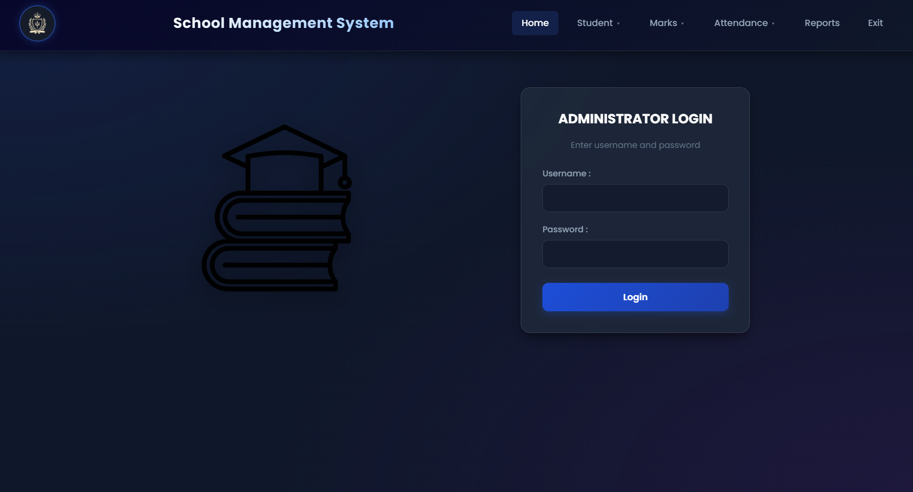
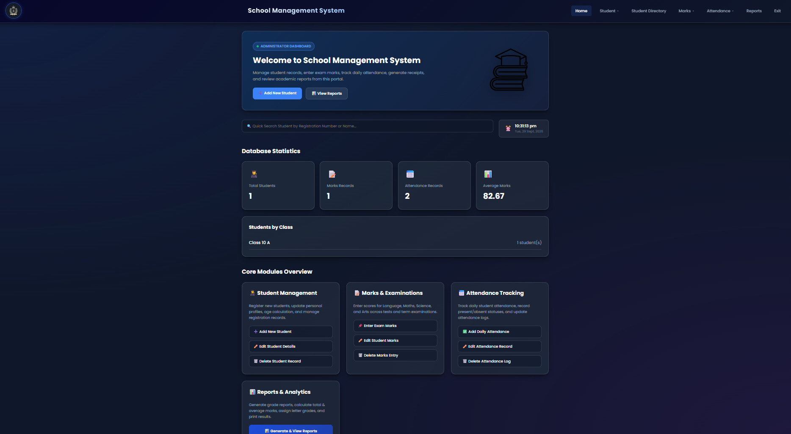
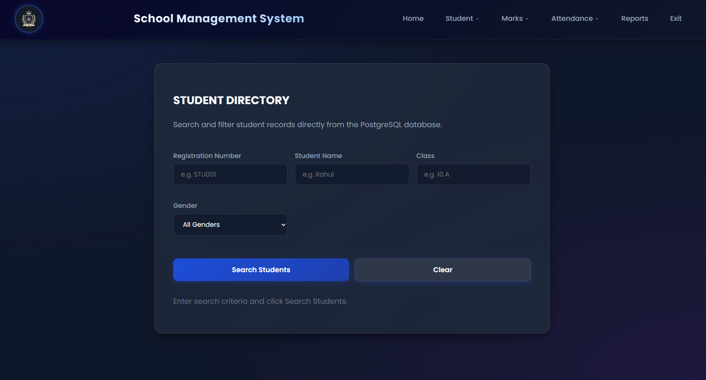
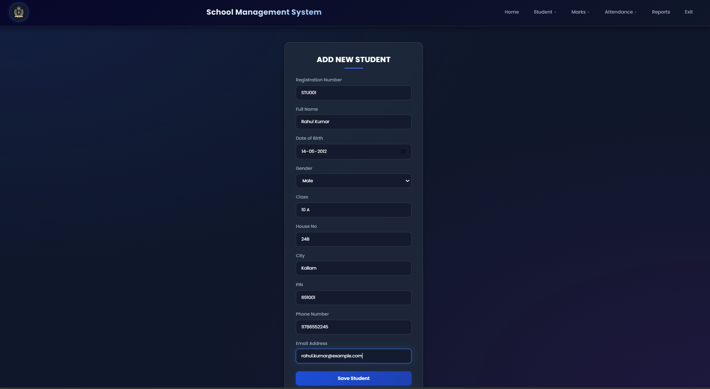
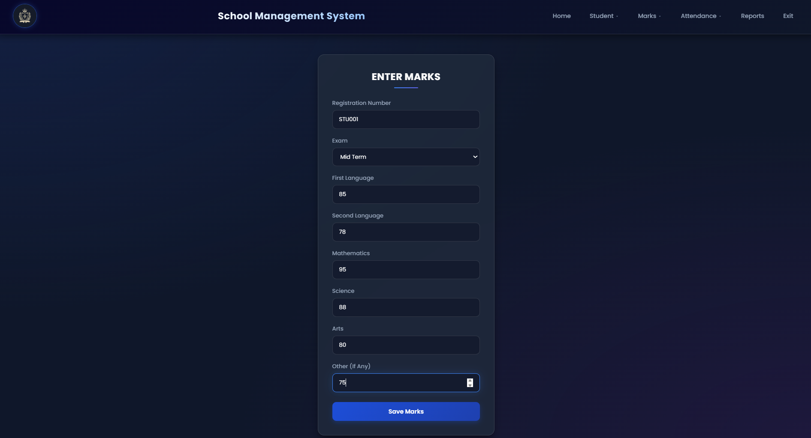
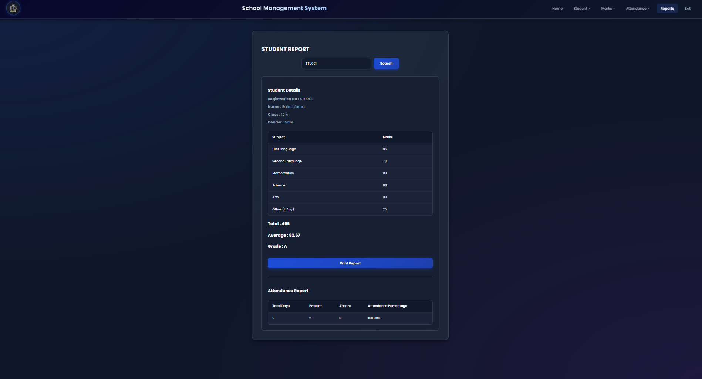

# School Management System

A full-stack School Management System developed as a DBMS project using **HTML, CSS, JavaScript, Node.js, Express.js, and PostgreSQL**.

The system provides modules for managing students, marks, attendance, and academic reports through a browser-based interface backed by a PostgreSQL database.

---

## 1. Project Overview

The School Management System provides a centralized platform for managing essential student and academic information.

### Objectives

- Manage student records.
- Add, edit, search, and delete student information.
- Manage student marks for examinations.
- Record and manage attendance.
- Generate academic reports.
- Demonstrate PostgreSQL database concepts.
- Implement constraints, foreign keys, views, indexes, joins, aggregation, and SQL queries.
- Provide a complete frontend-backend-database workflow.

---

## 2. Features

### Student Management

- Add students
- Edit students
- Delete students
- Search students by registration number
- Student directory
- Filter students by class

### Dashboard

- Display total number of students
- Display total marks records
- Display total attendance records
- Display average marks
- Display student distribution by class

### Marks Management

- Enter marks
- Edit marks
- Delete marks
- Store marks for First Language, Second Language, Mathematics, Science, Arts, and Others
- Support different examination types

### Attendance Management

- Add attendance
- Edit attendance
- Delete attendance
- View attendance by student
- Prevent duplicate attendance for the same student and date
- Attendance summaries and percentages

### Reports

- Generate student academic reports
- Display subject-wise marks
- Calculate total marks
- Calculate average
- Calculate grade

### Dashboard

| Method | Endpoint         | Description                                    |
| ------ | ---------------- | ---------------------------------------------- |
| GET    | `/api/dashboard` | Get dashboard statistics and students by class |

### Database Features

- Primary keys
- Foreign keys
- UNIQUE constraints
- CHECK constraints
- Identity columns
- Database views
- Indexes
- Aggregate queries
- GROUP BY
- INNER JOIN
- LEFT JOIN
- Subqueries

---

## 3. Tech Stack

### Frontend

- HTML5
- CSS3
- JavaScript

### Backend

- Node.js
- Express.js

### Database

- PostgreSQL 18

### Tools

- Visual Studio Code
- Git
- GitHub
- PostgreSQL / pgAdmin

---

## 4. Architecture

```mermaid
flowchart TD
    A[Frontend<br/>HTML • CSS • JavaScript]
    B[Backend<br/>Node.js • Express.js<br/>REST API]
    C[PostgreSQL<br/>school_management]

    A -->|HTTP Requests| B
    B -->|SQL Queries| C
    C -->|Query Results| B
    B -->|JSON Response| A
The frontend uses JavaScript `fetch()` requests to communicate with the Express.js REST API, while the backend uses PostgreSQL queries to access and modify the database.
```

### Request Flow

```text
User
  ↓
HTML / JavaScript Interface
  ↓
Express.js API
  ↓
PostgreSQL Database
  ↓
API Response
  ↓
Frontend Display
```

---

## 5. Project Structure

```text
school-managment-system/
│
├── index.html
├── dbms_home.html
├── add_student.html
├── edit_student.html
├── delete_student.html
├── student_search.html
├── enter_marks.html
├── edit_marks.html
├── delete_marks.html
├── add_attendance.html
├── edit_attendance.html
├── delete_attendance.html
├── reports.html
├── dbms.css
│
├── backend/
│   ├── .env.example
│   ├── db.js
│   ├── package.json
│   ├── package-lock.json
│   ├── server.js
│   └── routes/
│       ├── students.js
│       ├── marks.js
│       ├── attendance.js
│       └── reports.js
│
├── database/
│   ├── schema.sql
│   └── queries.sql
│
└── docs/
    └── DB-Design.docx
```

---

## 6. Installation & Setup

### Prerequisites

Install:

- Node.js
- PostgreSQL 18
- Git
- Visual Studio Code

### 1. Clone the Repository

```bash
git clone https://github.com/karthi-21-glh/School-Managment-System.git
cd School-Managment-System
```

### 2. Create the PostgreSQL Database

```sql
CREATE DATABASE school_management;
```

Connect to it:

```sql
\c school_management
```

### 3. Create the Schema

Run:

```sql
\i database/schema.sql
```

This creates the tables, constraints, and views.

### 4. Configure Environment Variables

Create `backend/.env`:

```env
DB_PASSWORD=your_postgresql_password
PORT=5000
```

Do not commit the actual `.env` file.

Use `backend/.env.example` as the template.

### 5. Install Dependencies

```bash
cd backend
npm install
```

### 6. Start the Backend

```bash
node server.js
```

The backend runs at:

```text
http://localhost:5000
```

### 7. Open the Application

Open:

```text
index.html
```

The frontend communicates with the Express backend through REST APIs.

---

## 7. Usage

### Navigation

```text
Home | Student ▼ | Student Directory | Marks ▼ | Attendance ▼ | Reports | Exit
```

### Student Workflow

1. Open **Student → Add Student**.
2. Enter student information.
3. Submit the form.
4. The frontend sends a POST request.
5. Express inserts the record into PostgreSQL.

### Marks Workflow

1. Open **Marks → Enter Marks**.
2. Enter the registration number.
3. Enter examination type.
4. Enter subject marks.
5. Submit the form.

### Attendance Workflow

1. Open **Attendance → Add Attendance**.
2. Enter registration number.
3. Select date.
4. Select Present or Absent.
5. Submit.

### Reports Workflow

1. Open **Reports**.
2. Enter the registration number.
3. The system retrieves the student's marks and report information.
4. Total marks, average, and grade are displayed.

---

## 8. Screenshots / Demo

### Login



### Dashboard



### Student Directory



### Student Management



### Marks Management



### Academic Report



## 9. API Documentation

### Students

| Method | Endpoint                | Description      |
| ------ | ----------------------- | ---------------- |
| GET    | `/api/students`         | Get all students |
| POST   | `/api/students`         | Add a student    |
| GET    | `/api/students/:reg_no` | Get a student    |
| PUT    | `/api/students/:reg_no` | Update a student |
| DELETE | `/api/students/:reg_no` | Delete a student |

### Marks

| Method | Endpoint              | Description             |
| ------ | --------------------- | ----------------------- |
| GET    | `/api/marks`          | Get all marks           |
| POST   | `/api/marks`          | Add marks               |
| GET    | `/api/marks/:reg_no`  | Get marks for a student |
| PUT    | `/api/marks/:mark_id` | Update marks            |
| DELETE | `/api/marks/:mark_id` | Delete marks            |

### Attendance

| Method | Endpoint                     | Description                  |
| ------ | ---------------------------- | ---------------------------- |
| GET    | `/api/attendance`            | Get attendance records       |
| POST   | `/api/attendance`            | Add attendance               |
| GET    | `/api/attendance/:reg_no`    | Get attendance for a student |
| PUT    | `/api/attendance/:attend_id` | Update attendance            |
| DELETE | `/api/attendance/:attend_id` | Delete attendance            |

### Reports

| Method | Endpoint               | Description               |
| ------ | ---------------------- | ------------------------- |
| GET    | `/api/reports`         | Get report records        |
| GET    | `/api/reports/:reg_no` | Get reports for a student |

---

## 10. Engineering Decisions

### PostgreSQL

PostgreSQL was selected because the project requires relational integrity, constraints, joins, aggregation, views, and structured SQL queries.

### REST API

The frontend communicates with PostgreSQL through an Express.js REST API instead of connecting directly to the database.

### Modular Backend

Routes are separated by functionality:

```text
routes/
├── students.js
├── marks.js
├── attendance.js
└── reports.js
```

### Database Constraints

The database uses:

- Primary keys
- Foreign keys
- UNIQUE constraints
- CHECK constraints
- NOT NULL constraints

### Derived Data

Age is derived from `date_of_birth` through the `student_details` view.

Total marks, average, and grade are derived through the `student_reports` view.

### Database Views

```text
student_details
student_reports
```

### Indexes

```sql
idx_student_class
idx_marks_reg_no
idx_attendance_reg_no
```

These support common class, student, marks, and attendance lookups.

---

## 11. Testing

### Student Testing

- Add student
- View student
- Search student
- Edit student
- Delete student
- Class filtering

### Marks Testing

- Enter marks
- Retrieve marks
- Edit marks
- Delete marks
- Verify subject marks
- Verify total, average, and grade

### Attendance Testing

- Add attendance
- Retrieve attendance
- Edit attendance
- Delete attendance
- Test duplicate attendance restriction

### Report Testing

- Retrieve student report
- Verify subject marks
- Verify total marks
- Verify average
- Verify grade

### Database Testing

- Primary key enforcement
- Foreign key enforcement
- Unique constraints
- Check constraints
- Duplicate attendance prevention
- Aggregate queries
- JOIN queries
- Subqueries
- Views
- Indexes

---

## 12. Limitations & Future Improvements

### Current Limitations

- Simple login interface.
- No full token-based authentication.
- Role-based access control can be expanded.
- The current system focuses on students, marks, attendance, and reports.
- Production/cloud deployment is not included in the current setup.

### Future Improvements

- Secure authentication and authorization
- Admin, teacher, and student roles
- Password hashing
- JWT/session-based authentication
- Teacher management
- Class and subject management
- Parent/student portals
- Automated report-card PDF generation
- Email notifications
- Attendance notifications
- Advanced dashboard analytics
- Responsive mobile interface
- Cloud deployment
- Database backup and recovery
- Audit logs
- Improved validation and error handling

---

## Database Design

### Main Entities

```text
ADMINISTRATOR
      │
      │ 1:N
      ▼
   STUDENT
   │  │  │
   │  │  └────────── 1:N ────── ATTENDANCE
   │  │
   │  └───────────── 1:N ────── MARKS
   │                              │
   │                              │ 1:N
   │                              ▼
   └────────────── 1:N ─────── REPORT
```

Database views:

```text
STUDENT_DETAILS  → VIEW
STUDENT_REPORTS  → VIEW
```

`Age` is derived from `DateOfBirth`.

`TotalMarks`, `Average`, and `Grade` are derived in `student_reports`.

### Tables

- `administrator`
- `student`
- `marks`
- `attendance`
- `report`

### Views

- `student_details`
- `student_reports`

### Important Constraints

```text
STUDENT
├── Primary Key: RegNo
├── Unique: Email
└── Foreign Key: AdminID

MARKS
├── Primary Key: MarkID
├── Foreign Key: RegNo
└── Marks range: 0–100

ATTENDANCE
├── Primary Key: AttendID
├── Foreign Key: RegNo
└── Unique: (RegNo, AttendanceDate)

REPORT
├── Primary Key: ReportID
├── Foreign Key: MarkID
└── Foreign Key: RegNo
```

---

## SQL Query Demonstrations

`database/queries.sql` contains examples covering:

1. SELECT
2. WHERE
3. ILIKE
4. ORDER BY
5. INSERT
6. UPDATE
7. DELETE
8. Aggregate functions
9. GROUP BY
10. INNER JOIN
11. LEFT JOIN
12. Multi-table JOIN
13. Subqueries
14. Views
15. Attendance summaries
16. Attendance percentages
17. Multi-condition searches
18. Marks summaries
19. Indexes
20. View definitions

> Some INSERT, UPDATE, and DELETE statements are demonstration/test queries. Do not execute the entire file blindly on a database containing data you want to preserve.

---

### Demo

The frontend can be viewed through GitHub Pages.  
The complete application requires the Node.js backend and PostgreSQL database to be running locally.

## Project Status

- [x] PostgreSQL database
- [x] Student CRUD
- [x] Marks CRUD
- [x] Attendance CRUD
- [x] Academic reports
- [x] Dashboard
- [x] Student Directory
- [x] PostgreSQL views
- [x] Database constraints
- [x] Foreign keys
- [x] Indexes
- [x] SQL query demonstrations
- [x] Backend REST APIs
- [x] Frontend integration

---

## Team

**Course:** Database Management Systems (DBMS)  
**Program:** S3 B.Tech Computer Science and Engineering  
**Institution:** Amrita School of Computing, Amritapuri Campus

### Team Members

- Karthikeya S Arun
- Ganga J
- Harshita Sanka

---

## License

This project was developed as an academic DBMS project.
